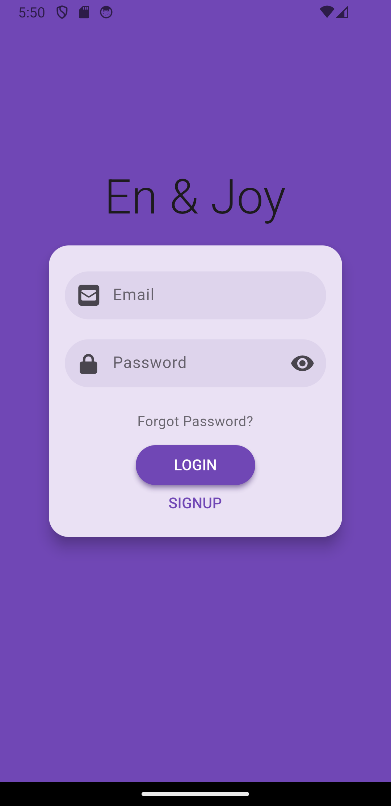
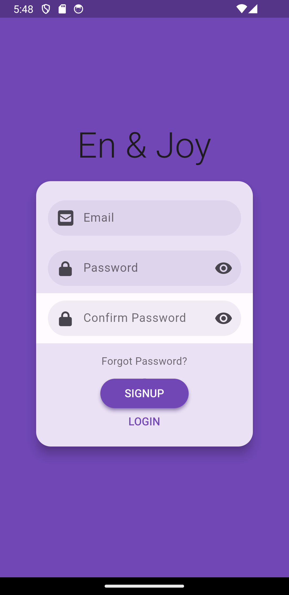
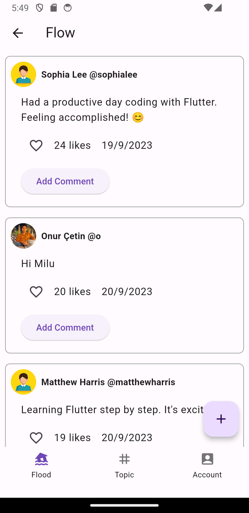
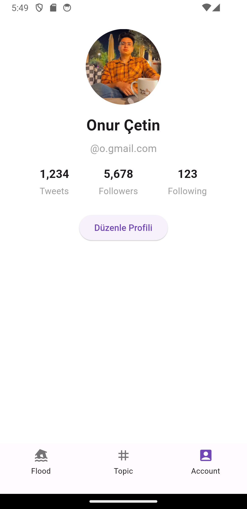

# Feed App
  Yapılanlar
    -Log In ve Sıgn In sayfası için Authentication
    -Etkileşim verme: Like ve comments(ancak kayıt edilmiyor)
    -Fake 10 gönderi
    -Özet akış-->Flood Page
    -Tarih sırasına göre akış
  Yapılamayanlar
    -Tweet floatingactionbutton ile oluşturuluyor ancak sadece firestore databaseye düşüyor.
    -Flood sayfasında göstermeyi maalesef yapamadım.  

## Screenshots

- Splash Screen -Log In -Sign In -First Page(Flood)

|                   0000                    |                   0001                   |                   0010                   |                       0011                        |
|:-----------------------------------------:|:----------------------------------------:|:----------------------------------------:|:-------------------------------------------------:|
|  |  |  |  |

- Trend Topics, Profile Page 

|                   0000                    |                   0001                   |                  0010                   |                      0011                      |
|:-----------------------------------------------:|:-----------------------------------------:|:--------------------------------------:|:------------------------------------------------:|
|  |  | 

  
## Kullanılanlar ve Paketler

- cupertino_icons: ^1.0.2
- flutter_login: ^4.2.1
- firebase_core: ^2.16.0
- firebase_auth: ^4.10.0
- cloud_firestore: ^4.9.2
